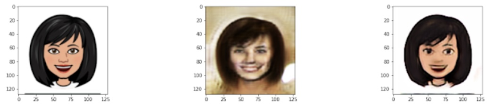
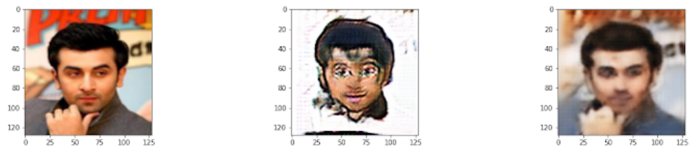

# GANimate
CycleGAN implementation which allows image-to-image translation between human faces and cartoon faces.

# Dependencies
* Python Version 3.8.5+
* PyTorch Version 1.8.0

# Instructions for Training
* If you have not yet downloaded the data, do so by uncommenting the "Download data" portion in train.py.
* Run train.py

**TODO :** add file for testing pre-existing weights.

# Results
I will summarize my results here, for a more detailed analysis of my training process, see [here](./Ganimate_Presentation.pdf)  
  
**Training Details:**
* Trained map from human to cartoon for 15 epochs.
* Continued to train the inverse map and both discriminators for an additional 16 epochs (total of 31 epochs for those networks).
* Learning parameters are the same as those in the train.py file and CycleGAN paper.

Here are some sample outputs after training:  
  
  

The left column of the images show the original domain image, the center column shows the mapped image, and the right column shows the cycled image.
